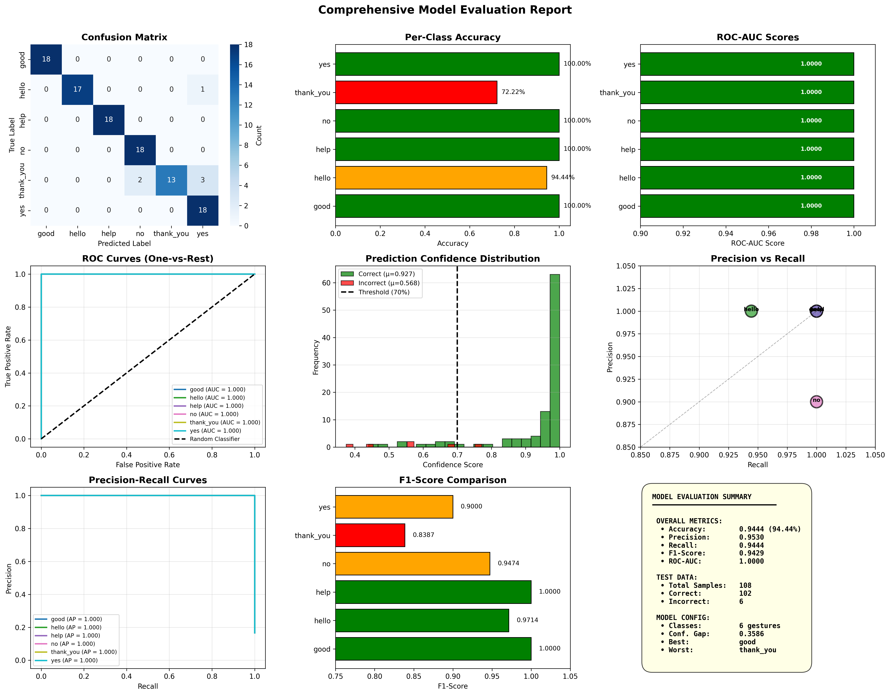
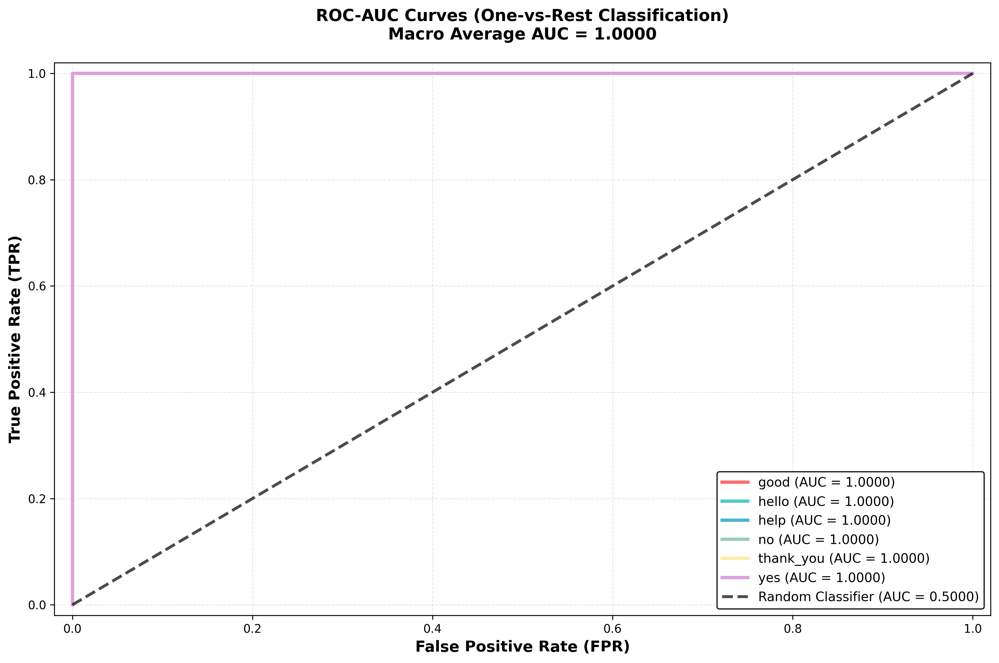
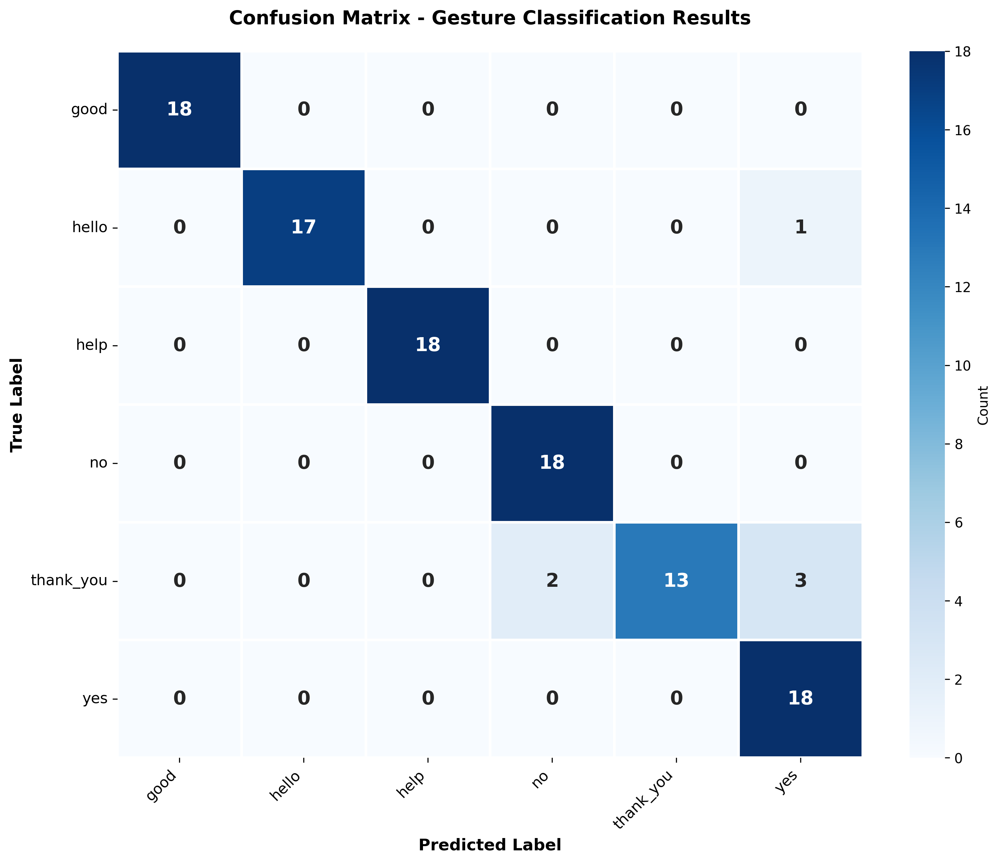

# Real-Time Indian Sign Language Interpreter Using MobileNetV2

## Overview
This project presents a real-time Indian Sign Language (ISL) interpreter that recognizes hand gestures using a deep learning model based on MobileNetV2 with transfer learning. The system captures hand gestures through a webcam and predicts the corresponding gesture class in real time.

---

## Features
- Real-time gesture recognition using webcam feed
- Lightweight and efficient MobileNetV2 architecture
- Transfer learning with fine-tuning for improved performance
- Six gesture classes:
  - `hello`
  - `yes`
  - `no`
  - `good`
  - `thank_you`
  - `help`
- Comprehensive evaluation metrics (Accuracy, Precision, Recall, F1-Score, ROC-AUC)

---

## Tech Stack
- **Language**: Python
- **Deep Learning**: TensorFlow / Keras
- **Computer Vision**: OpenCV
- **Data & Metrics**: NumPy, Scikit-learn, Seaborn, Matplotlib

---

## Project Structure

```text
sign-language-interpreter/
│
├── data/
│   ├── train/                  # Hand gesture images (120 images per class)
│   ├── label_map.pkl           # Class label encoding mapping
│   ├── X_train.npy, y_train.npy
│   ├── X_val.npy, y_val.npy
│   └── X_test.npy, y_test.npy
│
├── models/
│   └── isl_model.h5            # Trained MobileNetV2 model
│
├── scripts/
│   ├── data_collection.py      # Webcam dataset collection tool
│   ├── data_preprocessing.py   # Image loading, preprocessing & augmentation
│   ├── train_model.py          # MobileNetV2 transfer learning & fine-tuning
│   ├── evaluate_metrics.py     # Evaluation metrics & visualization generator
│   └── real_time_inference.py  # Real-time webcam gesture interpreter
│
├── images(isl)/                # Paper and architecture diagrams
├── requirements.txt            # Python dependencies
├── evaluation_metrics.png      # Comprehensive 9-panel evaluation dashboard
├── roc_auc_curves.png          # One-vs-Rest ROC-AUC curves
├── confusion_matrix.png        # High-resolution confusion matrix
├── .gitignore
└── README.md
```

---

## Methodology

1. **Data Collection**
   - Captured hand gesture images using webcam (`scripts/data_collection.py`)
   - 120 images collected per gesture class (720 total images)

2. **Preprocessing**
   - Resizing images to model input size (224x224x3)
   - Normalization using MobileNetV2 preprocessing
   - Stratified train-validation-test split (70% train, 15% val, 15% test)
   - Real-time training data augmentation (rotation, shift, zoom, shear, horizontal flip)

3. **Model Architecture**
   - MobileNetV2 base (pre-trained on ImageNet)
   - GlobalAveragePooling2D layer
   - Fully-connected dense layers (128 and 64 units) with ReLU, Batch Normalization, and Dropout
   - 6-unit Softmax output layer

4. **Training & Fine-Tuning**
   - Transfer learning approach
   - Fine-tuning top 30 layers of MobileNetV2 with Adam optimizer (`lr=1e-4`)
   - Balanced class weighting and EarlyStopping/ModelCheckpoint callbacks

5. **Inference**
   - Real-time gesture prediction using OpenCV webcam feed with confidence score thresholds

---

## How to Run

### 0. Install Dependencies
```bash
pip install -r requirements.txt
```

### 1. (Optional) Collect Custom Data
```bash
python scripts/data_collection.py
```

### 2. Preprocess Data
```bash
python scripts/data_preprocessing.py
```

### 3. Train Model
```bash
python scripts/train_model.py
```

### 4. Evaluate Model
```bash
python scripts/evaluate_metrics.py
```

### 5. Run Real-Time Inference
```bash
python scripts/real_time_inference.py
```
*Press `q` to exit the webcam window.*

---

## Results

| Metric | Score |
| :--- | :--- |
| **Accuracy** | **94.44%** |
| **Precision (macro)** | **0.9530** |
| **Recall (macro)** | **0.9444** |
| **F1-Score (macro)** | **0.9429** |
| **ROC-AUC (macro)** | **1.0000** |

---

## Visualizations

### Comprehensive Evaluation Dashboard


### ROC-AUC Curves (One-vs-Rest)


### Confusion Matrix


---

## Dataset

- Images were collected manually using a webcam feed.
- 6 classes: `good`, `hello`, `help`, `no`, `thank_you`, `yes`.
- Each class contains 120 images (720 total images).

---

## Future Improvements
- Increase dataset size and demographic diversity for better generalization.
- Add dynamic gesture support using temporal models (LSTM / GRU / 3D CNNs).
- Improve robustness to complex backgrounds and varied lighting conditions.
- Deploy as a lightweight web application or mobile app with TensorFlow Lite.

---

## Author
**Poovizhi V M** - poovizhivm@gmail.com

---

## License
This project is for academic purposes.